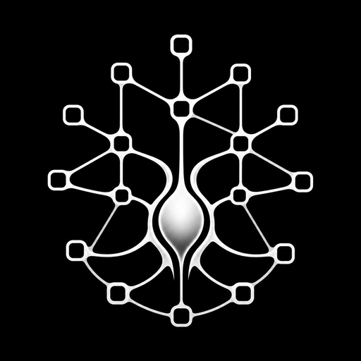
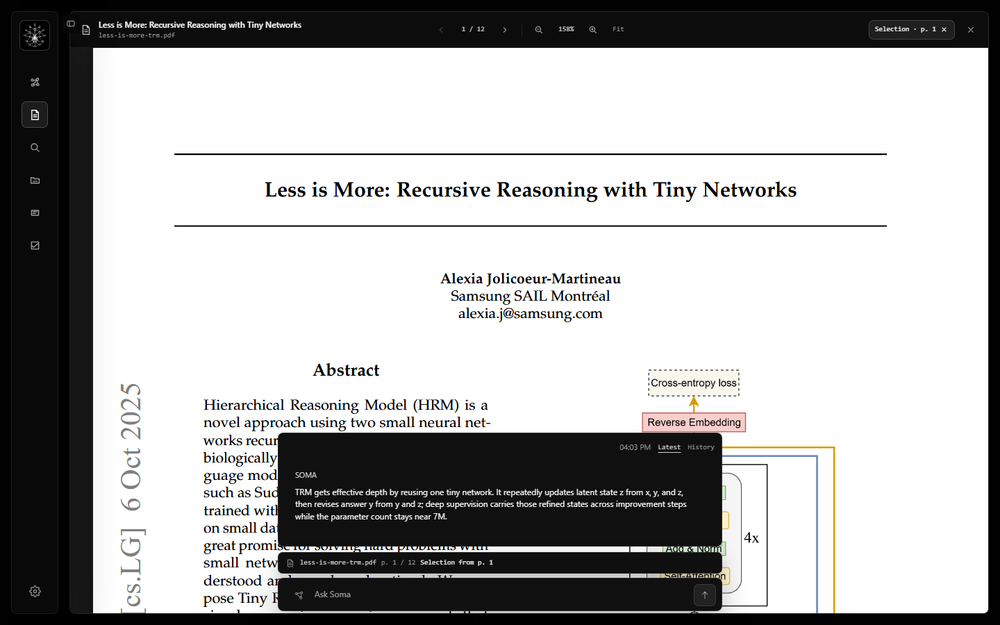
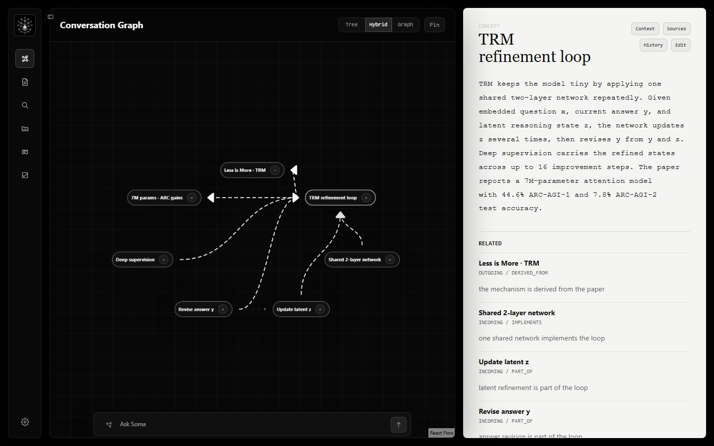

<p align="center">
  
</p>

<h1 align="center">Soma</h1>

<p align="center">
  <strong>Conversation with structure.</strong><br />
  Read papers, ask questions with context, and build an evidence-backed knowledge graph on your computer.
</p>

<p align="center">
  <a href="#main-functions">Main functions</a> |
  <a href="#architecture">Architecture</a> |
  <a href="#run-soma">Run Soma</a> |
  <a href="#project-status">Project status</a>
</p>

---

## Main functions

<p align="center">
  
</p>

<p align="center">
  <sub>Soma keeps the current page and selection attached to questions about Tiny Recursive Models.</sub>
</p>

### Read a paper

Soma opens a PDF in the primary workspace. You can scroll, change the zoom, fit pages,
and select text.

Soma keeps the page, zoom, scroll position, and selection when you change between
Paper and Graph. Only the Close control unloads the paper.

The chat dock stays at the bottom of the workspace. Its opaque surface stays readable
above the white paper.

### Control graph changes

Use the graph capture control for each chat turn:

- **Off**: Soma stores and answers the question. It does not change the graph.
- **On**: Soma sends supported changes through the validated graph-patch process.
- **Undo**: Soma reverses the latest safe chat patch. It does not overwrite later work.

Opening or reading a paper does not create graph data.

<p align="center">
  
</p>

<p align="center">
  <sub>The paper, shared network, recursive state updates, deep supervision, and results stay connected.</sub>
</p>

### Build reusable knowledge

```text
Import -> Read -> Ask -> Review -> Reuse
```

Imported conversations remain durable source records. Soma stores answers separately
from graph changes. Accepted nodes and edges keep their evidence and provenance.

## Architecture

Rust and Tauri own application behavior and durable data. React owns presentation and
interaction state. SQLite stores local workspace data.

```text
React features
    -> typed Tauri commands
Rust application modules
    -> graph, retrieval, review, chat, and jobs
    -> provider-neutral AI runtime
    -> SQLite and FTS5
```

The main directories are:

- `apps/desktop/src`: React desktop interface
- `apps/desktop/src-tauri`: Tauri shell, application behavior, and SQLite storage
- `crates/ai-runtime`: provider-neutral AI adapters
- `packages/contracts`: shared TypeScript contracts and validation
- `docs`: product, architecture, decisions, design, and methods
- `test`: contract tests and behavior tests

Read the [architecture overview](docs/architecture/README.md). The
[paper-reading contract](docs/architecture/paper-reading.md) and
[module boundaries](docs/architecture/module-boundaries.md) define important rules.

## Run Soma

Install these prerequisites:

- Node.js 24 or later
- Rust 1.92.0 with Cargo, rustfmt, and Clippy
- [Tauri v2 system prerequisites](https://v2.tauri.app/start/prerequisites/)

Run these commands:

```sh
npm ci
npx playwright install chromium
npm run desktop:dev
```

Use `npm run dev` to run the browser development surface.

## Verify and package

Run all verification checks:

```sh
npm run verify
```

Build native packages on the applicable operating system:

| Operating system | Command | Output |
| --- | --- | --- |
| Linux | `npm run desktop:build:linux` | Debian package and AppImage |
| macOS | `npm run desktop:build:macos` | App bundle and DMG |
| Windows | `npm run desktop:build:windows` | NSIS installer |

Use `npm run desktop:build` to build all native package types for the current host.
The project does not cross-compile desktop packages.

GitHub Actions runs tests and builds a native package on Ubuntu, macOS, and Windows.

## Project status

Soma is in active development. The repository contains cross-platform build and
verification paths.

Public binaries need a publisher identity and the applicable platform signing
credentials.

## License

Soma uses the [Apache License 2.0](LICENSE).
