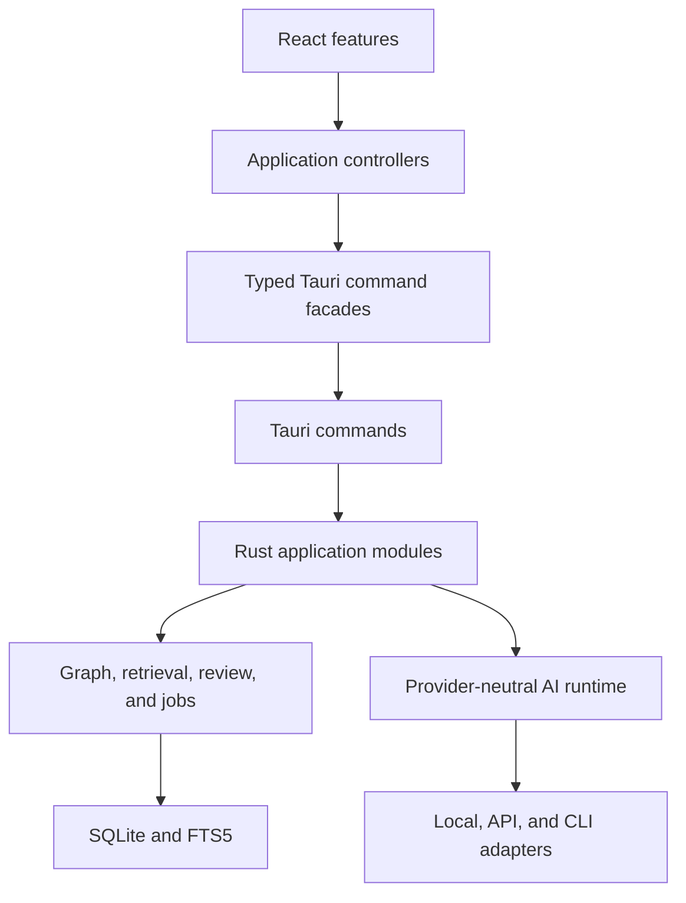
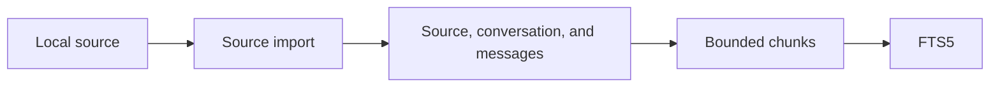
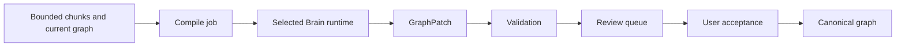
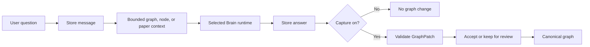
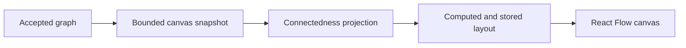

# Soma architecture

Soma is a local-first desktop workspace. It changes imported conversations into an
evidence-backed graph.

Users can also read and question PDF files in the same workspace. Model output cannot
bypass validation.

## System

The system uses:

- Tauri v2 and Rust for the desktop process, application behavior, and persistence
- Vite, React, and TypeScript for presentation and interaction
- React Flow for the graph canvas
- PDF.js for local PDF reading
- SQLite and FTS5 for local storage and search
- Zod for TypeScript process-boundary validation
- local, hosted, Codex, and Claude Code runtime adapters

`apps/desktop/src-tauri/src` is the only authority for persisted domain behavior.
TypeScript does not contain a second storage implementation.

## Invariants

1. Raw imported sources are durable. Graph operations never rewrite them.
2. Canonical graph truth contains accepted nodes, edges, body versions, and evidence.
3. Draft, proposed, deferred, rejected, and superseded items remain review state.
4. Accepted graph objects need evidence, user authorship, or validated chat-message
   evidence.
5. Projection and layout do not determine whether a graph object exists.
6. Startup canvas data and terminal review history are bounded.
7. Active review is complete. Soma loads full node detail only after selection.
8. AI output uses one `GraphPatch`. Failures and validation use typed contracts.
9. Soma stores chat answers separately from graph-patch acceptance.
10. Paper context grounds a chat turn. It changes graph truth only when capture is on.
11. The backend determines whether an undo operation is safe.
12. Compile execution uses the Brain settings captured at dispatch.
13. Job artifacts remain in the workspace job root.
14. Hosted inference never receives local source paths.
15. A background command uses the workspace captured at dispatch.
16. An old UI read cannot replace newer workspace or feature state.
17. Provider secrets cross only the credential-store boundary.
18. Existing-node updates need an exact snapshot precondition.
19. Schema migrations are ordered and atomic.
20. Soma rejects unsupported newer workspace versions.
21. Soma identifies an existing workspace before it starts a writable migration.
22. App-data files use one process lock and atomic replacement.
23. A mutation promise settles with its backend command.
24. Only a retry-safe read can use an independent frontend timeout.

## Import flow

Import creates source records and searchable chunks. It does not create graph truth.

## Compile flow

Chunk selection is deterministic and bounded. Soma stores partial coverage and shows
it to the user.

Hosted adapters send complete chunks that fit the request limit. Compile output always
goes to review.

## Direct-chat flow

A runtime failure does not create a patch. Existing-object proposals include trusted
snapshot preconditions.

The capture control is the only direct-chat mutation control. Opening a new paper sets
capture to off.

## Graph presentation flow

Connectedness changes visible edges and retrieval breadth. It does not change graph
truth.

Node positions and pins are layout state.

## Ownership

- `apps/desktop/src/app` composes the workspace and owns request controllers.
- `apps/desktop/src/features` owns product UI and local interaction state.
- `apps/desktop/src/shared/commands` owns typed process calls.
- `packages/contracts` owns TypeScript wire contracts and Zod schemas.
- `commands.rs` owns Tauri ingress and background dispatch.
- Rust domain modules own graph, retrieval, review, chat, jobs, workspace, and storage.
- `crates/ai-runtime` owns provider-neutral runtime interfaces and adapters.

Read `module-boundaries.md` for exact module charters.

## Change rules

- Extend an existing owner before you add a framework or parallel abstraction.
- Add a module only when it owns one cohesive policy.
- Keep Tauri commands thin.
- Keep SQL, file-system access, and provider execution out of React.
- Do not report a committed mutation as failed when only its refresh fails.
- Test behavior at public boundaries.
- Do not split a cohesive module only to reduce its line count.

## Excluded scope

Do not add these items without a validated workflow:

- a second JavaScript persistence implementation
- a second paper chat or a custom PDF renderer
- generic event sourcing for chat-patch undo
- a command bus, repository framework, or global state framework
- cloud sync, authentication, billing, or automatic browser capture
- a graph database or vector database without a measured SQLite limit
- export formats, OCR, or PDF annotation infrastructure without a selected workflow

Read `docs/decisions/` for accepted decisions. Read `v0-contracts.md` for current
contract rules.
