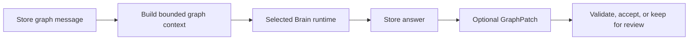
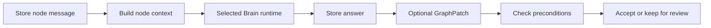

# Chat modes

Soma has two stored chat scopes. Focus-set chat is a graph-chat variant.

All modes use the selected Brain runtime and the same `GraphPatch` contract.

## Graph chat

Graph chat belongs to one workspace. It is the default question surface.

The context packet can contain:

- ranked graph nodes and their current bodies
- relevant edges and path fragments
- open questions and tasks
- recent graph-chat messages
- evidence excerpts
- selected focus node identifiers
- bounded PDF page and selection context

The response identifies each graph area that the runtime used.

## Focus-set chat

Focus-set chat is graph chat with selected node identifiers. It is not a separate
thread type.

Retrieval gives priority to the selected nodes and their bounded neighborhoods.
Clearing the focus set restores normal graph chat.

## Node chat

Node chat belongs to one node. It loads a bounded neighborhood around that node.

Node chat can propose:

- a node-body update
- a new node
- a new edge
- edge bridge text
- message evidence

An existing-object proposal includes the version that the runtime saw. Soma keeps a
stale proposal in review.

Soma never overwrites newer graph truth with a stale proposal.

## Paper context

Paper reading uses graph chat. A paper turn can contain:

- document name
- current page and page count
- bounded current-page text
- bounded selected text and its page

Selected text has priority over page text. Soma stores paper context with the turn.
Paper context is not graph truth.

The capture control applies to each turn:

- Off: Store and answer the turn. Ignore a returned patch.
- On: Validate a returned patch. Apply the normal direct-chat policy.

The control keeps its value during Graph and Paper view changes. A new paper sets the
control to Off.

## Direct-turn sequence

1. Store the user message.
2. Build a bounded context packet.
3. Release SQLite before the runtime call.
4. Call the selected runtime.
5. Store the assistant answer.
6. Normalize and validate a patch only when capture is on.
7. Accept only supported and evidence-backed objects.
8. Keep ambiguous, stale, or unsupported proposals in review.
9. Report patch errors without hiding the answer.

A runtime error or absent patch cannot create graph content.

## Review and undo

Compile-job patches always enter review. Direct chat can accept a patch only when all
proposal types are safe.

The review queue owns Accept, Reject, and Later actions. Merge candidates support
Reject and Later only.

The backend reports the latest safe undo operation. It reports one only when undo does
not overwrite later work.

The UI does not infer undo safety from message order.

## Excluded scope

- a separate source-conversation chat
- a second paper chat
- unbounded transcript or full-PDF context
- provider-specific patch formats
- frontend graph changes
- generic history rewind or event sourcing
