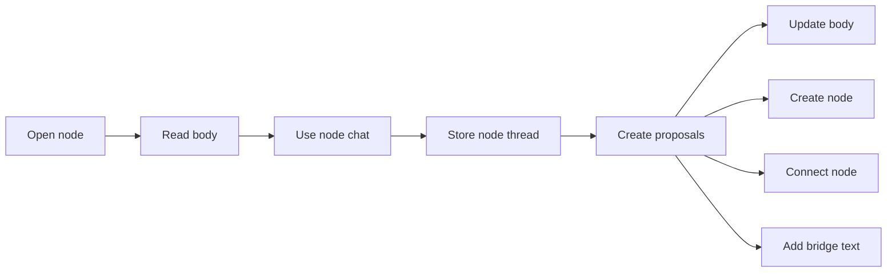

# Graph content model

Soma nodes are compiled conversation sections. They are not small graph labels.

The canvas shows compact cards. Node detail contains enough text for reading and chat.

## Graph card

A graph card is a navigation projection:

```json
{
  "id": "node_connectedness_slider",
  "type": "concept",
  "title": "Connectedness Slider",
  "preview": "A control that changes a dense graph into a tree, hybrid, or graph view.",
  "markers": ["source_backed", "ai_compiled"]
}
```

A card contains a title, preview, type, and applicable trust markers.

## Node detail

Node detail is the main reading surface:

```json
{
  "id": "node_connectedness_slider",
  "type": "concept",
  "title": "Connectedness Slider",
  "compiled_body": "A coherent section that preserves reasoning and removes repeated text.",
  "source_chunk_ids": ["chunk_1", "chunk_7", "chunk_12"],
  "body_version": 3,
  "status": "active",
  "markers": ["source_backed", "ai_compiled"]
}
```

A compiled body is usually 300 to 1,500 words. It must not contain more than 1,500
words.

These rules apply:

- Soma can extract, rewrite, and synthesize node text.
- A user can edit a node body.
- Node chat can propose a full replacement or an appended section.
- Body versions start with version 1.
- A user can restore an earlier body version.

## Trust markers

Do not use numeric confidence as the main trust indication.

Presentation surfaces can use these markers:

- `source_backed`
- `edited_by_user`
- `ai_compiled`
- `needs_review`
- `has_unresolved_merge`
- `has_thread_updates`

Trust depends on provenance and workflow state. A user must be able to inspect the
source and the accepted action.

## Node chat

Node chat is part of node detail:



A new message can add a graph object or improve the current node body.

Graph chat remains separate from node chat. Read `chat-modes.md` for its rules.

## Edge bridge text

An edge can contain short bridge text:

```json
{
  "source_node_id": "node_connectedness_slider",
  "target_node_id": "node_cognitive_overload",
  "type": "mitigates",
  "bridge_text": "Lower connectedness changes a dense graph into a navigable hierarchy.",
  "source_chunk_ids": ["chunk_7"],
  "status": "active"
}
```

A path must read in this order:

```text
node body -> bridge text -> node body -> bridge text -> node body
```

Do not add bridge text when the relation is clear. Keep necessary bridge text very
short.

## Canvas read model

`load_graph_canvas_snapshot` returns accepted graph truth. It does not return review
objects.

A canvas node contains:

- identity, type, title, preview, markers, and status
- source chunk identifiers and body version identifiers
- creation and update times

`load_graph_node_detail` returns the full body, sections, evidence, limits, and version
history.

A canvas edge contains:

- identity, source, target, type, bridge text, and status
- source chunk identifiers and trust markers
- creation and update times

The canvas snapshot does not contain:

- full node bodies
- graph chat or node chat
- review proposals
- projection state
- layout state

The inspector can calculate neighbors from accepted nodes and accepted edges.

## Paths and focus sets

A path is a connected set of nodes and edges. Saved paths are not part of v0.

In v0, users select a focus set. Soma uses the selected bodies and bridge text as
shared graph-chat context.
