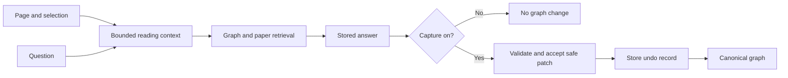

# Paper reading and contextual chat

## User result

Soma opens a paper in the primary document surface. The user can read, scroll, change
zoom, fit pages, and select text.

The existing graph chat uses the current page and retained selection. Soma does not
add a second chat surface.

The user controls graph capture:

- Off: Answer and store the question. Do not change the graph.
- On: Use the evidence-backed direct-chat patch process.
- Undo: Reverse the latest safe chat patch.

## Ownership

| Owner | Responsibility |
| --- | --- |
| `features/source-reader` | PDF rendering, reading state, selection, and bounded context |
| `features/graph-chat` | Composer, capture control, context display, and undo control |
| `packages/contracts` | Reading context, chat arguments, and undo result |
| `retrieval` | Graph retrieval with selected or visible paper text |
| `chat_turns` | Answer storage and capture policy |
| `graph_write_model` | Reversible acceptance data and safe undo |
| `database` | SQLite schema for the undo journal |

## Turn flow

## Invariants

1. Opening or reading a paper does not create graph truth.
2. Selected text has priority over visible-page text.
3. Contract and backend limits apply to both text values.
4. Soma waits for current-page extraction before it sends a paper turn.
5. The draft remains editable while extraction is in progress.
6. Both selection endpoints must be inside the PDF viewport.
7. Every turn sends the current capture state.
8. The backend ignores a patch when capture is off.
9. Undo applies to one patch and uses last-in, first-out order.
10. Undo cannot replace a later accepted or direct edit.
11. An unsafe undo operation fails with a visible error.

## Excluded scope

- a second side chat
- PDF editing or annotations
- optical character recognition
- cloud document synchronization
- automatic import of each PDF page
- arbitrary graph time travel
- a second graph-change implementation

Add one of these functions only when a selected workflow needs it.

## Acceptance checks

- A local PDF uses a continuous reader with page, zoom, fit, and selection controls.
- The next question contains the current page and retained selection.
- Send waits for the exact current-page extraction.
- Capture Off returns an answer with no graph changes.
- Capture On uses the validated patch process.
- Undo restores supported new-node and body-update changes.
- Repeated or unsafe undo fails.
- Reader and chat controls remain usable in narrow windows.
- Reduced-motion settings remain usable.
